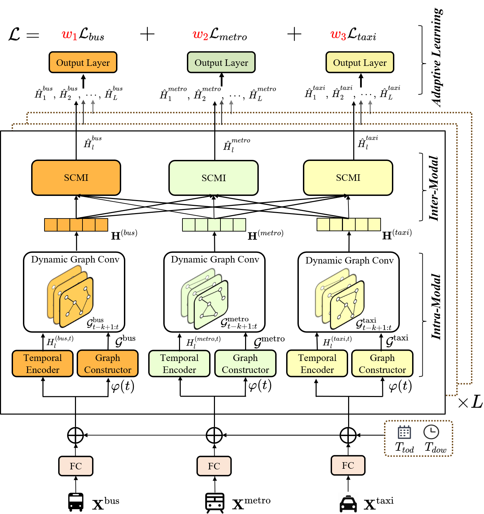

# Multimodal Urban Travel Demand Forecasting via Adaptive Dynamic Graph Learning 

This repository contains the PyTorch implementation for the paper "Multimodal Urban Travel Demand Forecasting via Adaptive Dynamic Graph Learning". Our work proposes **MM-DyGNN**, a novel framework for urban travel demand forecasting. It addresses the challenge of capturing complex and dynamic spatial-temporal dependencies from multimodal data sources (subway, taxi, bike-sharing). MM-DyGNN adaptively learns graph structures and utilizes a dynamic graph neural network to effectively model the evolving relationships between different transportation systems.



## 💿Requirements

The code is built with BasicTS, you can easily install the requirements by (take Python 3.10 + PyTorch 2.3.1 + CUDA 12.1 as an example):

```bash
# Install Python
conda create -n BasicTS python=3.10
conda activate BasicTS
# Install PyTorch
pip install torch==2.3.1 torchvision==0.18.1 torchaudio==2.3.1 --index-url https://download.pytorch.org/whl/cu121
# Install other dependencies
pip install -r requirements.txt
```

More details can be found in [BasicTS](https://github.com/GestaltCogTeam/BasicTS).

## 📦 Data Preparation

1. **Data Availability**
   > The *Shenzhen Multimodal Transport Demand Dataset* is collected under a joint agreement with the Shenzhen Transportation Bureau.  
   > **Public redistribution is temporarily unavailable** while we finalise an English-language licence.  
   > - **Status:** _under licence review_  
   > - **Expected release:** processed (anonymised) files and loading scripts will be hosted here once the review is complete.  
   > - **Early access:** If your institution already has a data-sharing MoU with Shenzhen TU, please email **<2410263042@stumail.sztu.edu.cn>** with subject `MMTD Data     Request`, briefly stating affiliation and research purpose.


3. **File Structure:** After downloading, please place the data files in the `dataset/` directory and ensure the structure is as follows:

   ```
   MM-DyGNN/
   ├── datasets/
   │   └── [SZM]/
   │       ├── data.dat
   │       └── desc.json
   ├── experiments/
   ...
   ```

   The `data.dat`  contain the multi-modal transport demand  data and `desc.json`  file contains metadata about the dataset, including: shape of the data、feature descriptions、number of time slices、ratios for training, validation, and test sets...

## 🎯 Training

Our model based [BasicTS ](https://github.com/GestaltCogTeam/BasicTS) platform.

You can modify the parameters in the `MM_DyGNN.py` file, such as: prediction time step, learning rate, minimum batch, etc.

```bash
python experiments/train.py --cfg MM_DyGNN/SZM.py --gpus '0'
```

For baseline models run

```bash
python experiments/train.py --cfg baselines/${MODEL}/SZM.py --gpus '0'
```

More details can be found in [BasicTS](https://github.com/GestaltCogTeam/BasicTS).

## Citation

A paper is in progress, and the citation will be added here.

