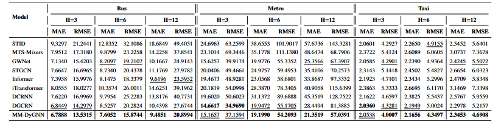
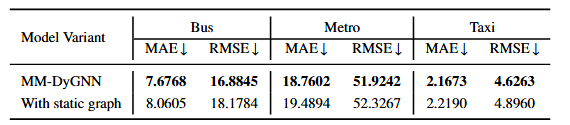
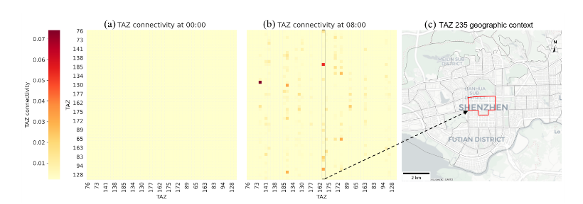
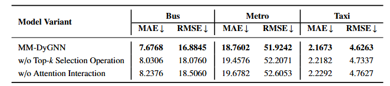
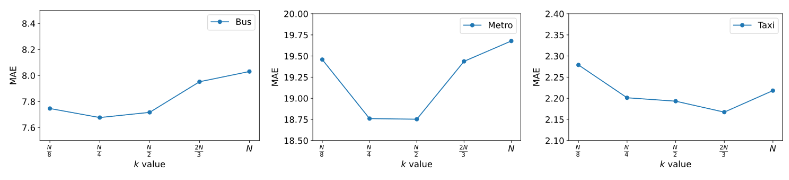
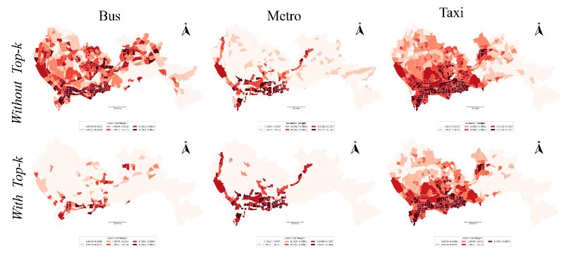
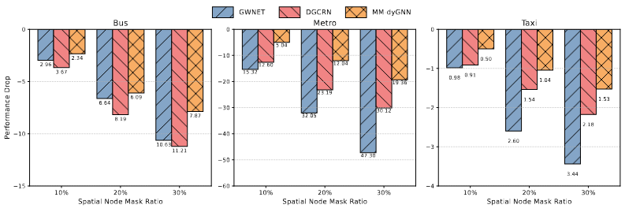

####   **Table 3: Main Performance Comparison** 



To generate the data for this table, you need to train and evaluate both the baseline models and our MM-DyGNN model.

1. Train and Evaluate Baseline Models: Execute the training script for each baseline model. You will need to replace `{model_name}` and `{config_name}` with the appropriate names for each baseline you wish to run. Replace `{gpuid}` with the ID of the GPU you want to use.

   ```
   # Example for a single baseline model
   python experiments/train.py --cfg baselines/{model_name}/{config_name}.py --gpus '{gpuid}'
   ```

2. Train the MM-DyGNN Model: Next, run the training script for our proposed MM-DyGNN model.

   ```
   python experiments/train.py --cfg MM_DyGNN/SZM.py --gpus '{gpuid}'
   ```

After running these scripts, the console output will display the MAE and RMSE values for each model, which you can use to populate Table 3.

#### Table 4 & Figure 5: Ablation Study and Case Study on Dynamic Graph

Table 4 evaluates the contribution of the dynamic graph constructor by comparing it to a static graph version. Figure 5 visualizes the learned bus connectivity at different times of the day to illustrate the dynamic nature of the graph.

* **To reproduce Table 4** **：The performance of a static graph version of our model, you need to modify the configuration file.**

  * **Step 1: Modify the Configuration**: Open the configuration file: `../MM_DyGNN/SZM.py`. Find the `days` parameter and change its value to `1`. This forces the model to use a static graph instead of a dynamic one.

  * **Step 2： Run the Experiment:** Execute the training script with the modified configuration.

    ```bash
    # Run the ablation study for the dynamic vs. static graph、
    # change the parameter 'days' 
    python experiments/train.py --cfg MM_DyGNN/SZM.py --gpus '{gpuid}'
		
		The output will provide the performance metrics for the static graph version of MM-DyGNN.



* **To reproduce Figure 5：**

Use the plotting script to visualize the learned graph for the bus mode. This script loads the dynamic graph model to generate the heatmaps.

``` bash
python ./visualization/fig_5.py
```



#### Table 5 & Figures 6-7: Ablation Study and Case Study on SCMI Module

* **To reproduce Table 5**:This study analyzes the contribution of SCMI module. It compares the full model against two variants: one without top-k selection and another using simple summation instead of an attention mechanism.

You will need to run two separate experiments by modifying the configuration file.

1. **Variant 1: No Top-k Selection**

   - **Modify Config:** Open `./MM_DyGNN/SZM.py` and change the value of the `k` parameter to `None`.

   - **Run Experiment:**

     ```
     python experiments/train.py --cfg MM_DyGNN/SZM.py --gpus '{gpuid}'
     ```

2. **Variant 2: Simple Summation Fusion**

   - **Modify Config:** Open `./MM_DyGNN/SZM.py` and change the `fusion_way` parameter to use the simple summation method.

   - **Run Experiment:**

     ```
     python experiments/train.py --cfg MM_DyGNN/SZM.py --gpus '{gpuid}'
     ```

The results from these runs will allow you to populate the ablation study results in Table 5.



* **To reproduce Figure 6:** Run the hyperparameter analysis script for `k`. This script tests different values for `k` and plots the resulting MAE for each transport mode.

  * **Step 1: Run the model with different $k$ value**

    Modify Config File: Open `./MM_DyGNN/SZM.py` and change the value of the `k` parameter to different number.

    the with this config file run:

    ```bash
    python experiments/train.py --cfg MM_DyGNN/SZM.py --gpus '{gpuid}'
    ```

  * **Step 2: Plot the Attention Maps**

    run the scrips:

    ```bash
    python ./visualization/fig_6.py
    ```

    

* **To reproduce Figure 7:** This process involves two steps: first, extracting the attention maps from the trained model using a hook function, and second, running the plotting script.

  * **Step 1: Extract Attention Maps with a Hook Function**

  To get the attention maps, you need to use a PyTorch hook to capture the intermediate outputs of the SCMI module during model inference. Add the following helper function to  `runner`  at  `./basicts/runners/runner_zoo`.

  * **Step 2: Plot the Attention Maps**
  
    Once you have saved the attention maps, use the provided plotting script to generate the visualizations.
  
    ```bash
    # Generate spatial distribution maps of attention weights
    python ./visualization/fig_7.py
    ```
    
    

#### Reproducing Robustness Analysis Figure

* **To reproduce Figure 8 :** It demonstrates the model's resilience to missing data by randomly masking input from spatial nodes and comparing the performance drop against strong baselines.

  * **Step 1: Run the robustness experiment with different mask ratio.**


  Modify Config File: Open `./MM_DyGNN/SZM.py` and change the value of the `mask_ratio` parameter to different number.

  the with this config file run:

  ```bash
  python experiments/train.py --cfg MM_DyGNN/SZM.py --gpus '{gpuid}'
  ```

  * **Step 2: Plot the Attention Maps**

  Record the performance of different mask and change the record `data_dict`,then plot the fig by:

  ```bash
  python ./visualization/fig_8.py 
  ```

  